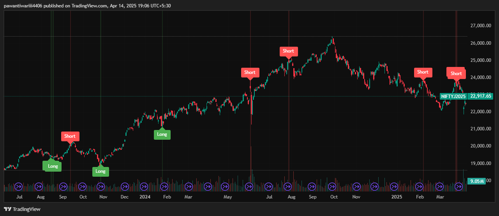

# pine-script-indicators
A showcase of advanced Pine Script indicators built for TradingView.
# Short Term Mean Reversion Indicator

## Description
The **Short Term Mean Reversion** indicator identifies potential **counter-trend trading opportunities** based on price behavior around Bollinger Bands. It detects short-term price reversals when the price deviates significantly from its recent average. This indicator can be used for **scalping** or **range-bound market strategies**.

### **Screenshot of Indicator in Action:**

## Pine Script Code:
The full Pine Script code for the indicator is available in the ([src/short_term_mean_reversion.pine](https://github.com/Pa1Tiwari/pine-script-indicators/blob/217cc7e0dff92ad974cffef45b2eadf06387349a/src/short_term_mean_reversion.pine))

### **Core Features:**
- **Long signal** (Green): When the price opens below the lower Bollinger Band and closes higher (bullish reversal).
- **Short signal** (Red): When the price opens above the upper Bollinger Band and closes lower (bearish reversal).
- Customizable **Bollinger Band settings** (length and standard deviation).
- Displays visual **signals** on the chart with arrows and labels.
- Background color highlights for long and short signals.

### **Usage:**
This indicator works best in **range-bound markets** or for **short-term scalping** strategies. It is recommended to use it in conjunction with other indicators or price action analysis for better accuracy.

# Ultimate Multi-Timeframe Multi-Averages

## Description
The **Ultimate Multi-Timeframe Multi-Averages** indicator is a powerful tool for tracking multiple moving averages across different timeframes. It allows traders to overlay **EMA, SMA, SMMA, WMA, and VWMA** from higher or lower timeframes onto any chart. This is particularly useful for identifying broader trend directions, support/resistance levels, and crossovers without switching timeframes.

The script supports two fully customizable modules with three averages each, giving you deep control over your technical analysis setup.

### **Screenshot of Indicator in Action:**

## Pine Script Code:
The full Pine Script code for the indicator is available in the ([src/MultiAverages MultiTimeframe Indicator.txt](https://github.com/Pa1Tiwari/pine-script-indicators/blob/fd27fac7fa58ad82d5945e25de8b4069d6fff730/src/MultiAverages%20MultiTimeframe%20Indicator.txt))

### **Core Features:**
- Displays **multiple types of moving averages** (EMA, SMA, SMMA, WMA, VWMA).
- Supports **multi-timeframe plotting** for all averages (e.g., daily EMA on a 1-hour chart).
- Highlights **crossovers between moving averages** for better entry/exit decision-making.
- Two independent modules for comparing averages from different timeframes.
- Optional usage of the current chart’s timeframe for the second module.

### **Usage:**
Ideal for **trend-following strategies**, **multi-timeframe confluence**, and **swing trading**. The script provides critical information for making more informed entries and exits based on trend alignment across timeframes.

# Candlestictk Detection

## Description

### Core Functionality
-This indicator combines three technical analysis approaches to generate trading signals:

-Candlestick Pattern Recognition - Identifies 12 classic reversal patterns

-Trend Filter - Uses an 8-period EMA (default) to determine market direction

-Momentum Confirmation - Employs a Stochastic oscillator to validate overbought/oversold conditions

