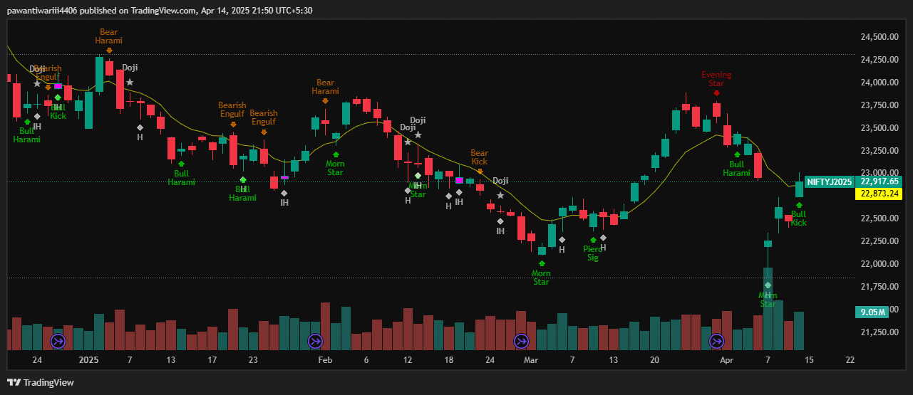

# pine-script-indicators
A showcase of advanced Pine Script indicators built for TradingView.

# Market Structure and Order Blocks Indicator  

## Description  
This Pine Script indicator identifies **market structure shifts** and highlights **order blocks** directly on the chart.  
It plots swing highs and lows based on pivot logic, dynamically extending them until invalidation, and then marks bullish or bearish **Fair Value Gaps (FVGs)** that emerge from structure breaks.  

The script supports **multi-timeframe analysis** by letting you choose a higher timeframe for structure calculation, enabling traders to combine lower-timeframe execution with higher-timeframe order block context.  

---

## Screenshot  
 

---

## Code Path  
The full Pine Script code for the indicator is available in the [src/mtf-orderblock-src](https://github.com/Pa1Tiwari/pine-script-indicators/blob/f9a5024a995ab0e4ceb6371d1e2816d77c6cc816/src/mtf-orderblock-src)

---

## Features  
- Detects and plots **swing highs and swing lows** dynamically.  
- Automatically extends swing lines until structure is broken.  
- Highlights **bullish and bearish Fair Value Gaps (FVGs)** that form after structural breaks.  
- Customizable **pivot lookback (calculation bars)** to refine swing detection.  
- Multi-timeframe support: analyze structure and order blocks from any timeframe.  
- Color-coded visuals for clarity:  
  - Maroon lines → Swing highs  
  - Aqua lines → Swing lows  
  - Teal boxes → Bullish FVGs  
  - Maroon boxes → Bearish FVGs  

---

## Usage  
1. Add the indicator to your TradingView chart.  
2. Select a higher timeframe for structure (e.g., 1H or 4H) while trading lower timeframes.  
3. Use swing levels and FVG zones to identify liquidity areas and order block formations.  
4. Combine with other Smart Money Concepts (SMC) tools for confluence.  

---

# Fair Value Gap (FVG) Indicator  

## Description  
This Pine Script indicator automatically detects and highlights **Fair Value Gaps (FVGs)** on the chart.  
It identifies both **bullish** and **bearish** FVGs using swing-based logic and dynamically extends the gaps until they are filled.  
The script includes advanced filtering such as **gap size thresholds**, **swing point validation**, and an optional **09:15 candle-based calculation** (useful for Indian markets).  

FVGs are widely used in institutional trading concepts to identify areas where price may return to rebalance liquidity.  

---

## Screenshot  
 

---

## Code Path  
The full Pine Script code for the indicator is available in the [src/fvg-indicator-src](https://github.com/Pa1Tiwari/pine-script-indicators/blob/ceece8cf6dbcb29eb553075acd11d94e107b7d59/src/fvg-indicator-src)

---

## Features  
- Detects **bullish and bearish Fair Value Gaps** in real-time.  
- Highlights FVGs with colored boxes:  
  - Green = Bullish gaps  
  - Red = Bearish gaps  
- Automatic extension of FVG boxes until price closes the imbalance.  
- Adjustable **minimum and maximum gap size** (percentage-based).  
- Swing validation using customizable bar lookback for strong levels.  
- Optional **09:15 candle-based FVG detection** (for markets that open at that time, e.g., NSE).  
- Auto-clears old FVGs once the user-defined history limit is reached.  

---

## Usage  
1. Add the indicator to your TradingView chart.  
2. Adjust FVG size filters and swing settings to match your strategy.  
3. Use the highlighted zones to plan liquidity-based setups (e.g., re-entries, continuation trades, or reversals).  
4. Combine with market structure or order blocks for confluence.  

---

# Short Term Mean Reversion Indicator

## Description
The **Short Term Mean Reversion** indicator identifies potential **counter-trend trading opportunities** based on price behavior around Bollinger Bands. It detects short-term price reversals when the price deviates significantly from its recent average. This indicator can be used for **scalping** or **range-bound market strategies**.

### **Screenshot of Indicator in Action:**

## contact for Script Code:

### **Core Features:**
- **Long signal** (Green): When the price opens below the lower Bollinger Band and closes higher (bullish reversal).
- **Short signal** (Red): When the price opens above the upper Bollinger Band and closes lower (bearish reversal).
- Customizable **Bollinger Band settings** (length and standard deviation).
- Displays visual **signals** on the chart with arrows and labels.
- Background color highlights for long and short signals.

### **Usage:**
This indicator works best in **range-bound markets** or for **short-term scalping** strategies. It is recommended to use it in conjunction with other indicators or price action analysis for better accuracy.

# Ultimate Multi-Timeframe Multi-Averages

## Description
The **Ultimate Multi-Timeframe Multi-Averages** indicator is a powerful tool for tracking multiple moving averages across different timeframes. It allows traders to overlay **EMA, SMA, SMMA, WMA, and VWMA** from higher or lower timeframes onto any chart. This is particularly useful for identifying broader trend directions, support/resistance levels, and crossovers without switching timeframes.

The script supports two fully customizable modules with three averages each, giving you deep control over your technical analysis setup.

### **Screenshot of Indicator in Action:**

## Pine Script Code:
The full Pine Script code for the indicator is available in the ([src/MultiAverages MultiTimeframe Indicator.txt](https://github.com/Pa1Tiwari/pine-script-indicators/blob/fd27fac7fa58ad82d5945e25de8b4069d6fff730/src/MultiAverages%20MultiTimeframe%20Indicator.txt))

### **Core Features:**
- Displays **multiple types of moving averages** (EMA, SMA, SMMA, WMA, VWMA).
- Supports **multi-timeframe plotting** for all averages (e.g., daily EMA on a 1-hour chart).
- Highlights **crossovers between moving averages** for better entry/exit decision-making.
- Two independent modules for comparing averages from different timeframes.
- Optional usage of the current chart’s timeframe for the second module.

### **Usage:**
Ideal for **trend-following strategies**, **multi-timeframe confluence**, and **swing trading**. The script provides critical information for making more informed entries and exits based on trend alignment across timeframes.

# Candlestictk Detection

## Description

-This indicator combines three technical analysis approaches to generate trading signals:

-Candlestick Pattern Recognition - Identifies 12 classic reversal patterns

-Trend Filter - Uses an 8-period EMA (default) to determine market direction

-Momentum Confirmation - Employs a Stochastic oscillator to validate overbought/oversold conditions

### **Screenshot of Indicator in Action:**

## Pine Script Code:
The full Pine Script code for the indicator is available in the ([src/Candlestick_detector](https://github.com/Pa1Tiwari/pine-script-indicators/blob/a0cc8bc976fec19013132291e7acba6cddcefe00/src/Candlestick_detector))

## Ideal Usage
-Timeframes: 1H to Daily charts

-Market Conditions: Works best in trending markets

-Confirmation: Should be used with other indicators or price action analysis

-This indicator provides visual pattern recognition with technical confirmation, helping traders spot potential reversal points in the context of the current trend and momentum conditions.

